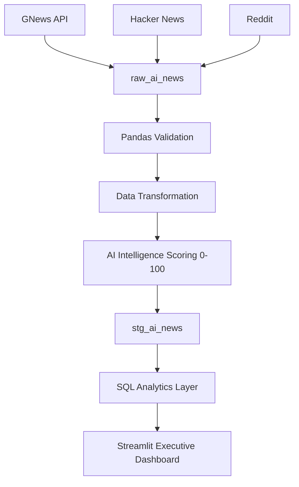

# AI Pulse — GenAI Industry Trends Warehouse

> **Automatically ingests AI news from multiple public APIs, stores it in a PostgreSQL warehouse, validates and transforms it, scores it with a proprietary Intelligence Score, and serves it through a production-ready Streamlit analytics dashboard.**


---

## 📌 Project Overview
**AI Pulse** is a Data Engineering portfolio project built during a 5-week internship (June–July 2026). It simulates real Junior Data Engineer work at a fictional startup that sells insights about the Generative AI industry.

The project evolves week-by-week from a simple API → PostgreSQL pipeline into a fully deployed, multi-source analytics system with dashboards, containerization, and production-grade practices. **This repository represents the end of Week 3** — concluding the Multi-Source Ingestion, UI finalization, and Mentorship Audit phase.

---

## 🚨 Business Problem
Analysts and researchers at AI Pulse currently spend **3–5 hours per day** manually browsing news websites to understand trends in the Generative AI space. This process is:
- **Inconsistent** — different analysts use different sources.
- **Non-reproducible** — no historical data is saved for trend analysis.
- **Slow** — analysis is always behind real-time events.
- **Narrow** — relying on a single source misses community-driven insights.

## 💡 Solution
Build a reusable multi-source data pipeline that automatically collects AI news every day from GNews, Hacker News, and Reddit. Store it in a structured warehouse, assign an *AI Intelligence Score* to filter out noise, and present actionable insights through a premium, Bloomberg-style Executive Dashboard.

---

## 🏗️ Architecture Diagram


---

## 🌊 Data Flow
1. **Ingestion Layer:** Concurrent fetching (via `ThreadPoolExecutor`) pulls articles/posts from GNews, Hacker News, and Reddit.
2. **Raw Layer (`raw_ai_news`):** Immutable, append-only PostgreSQL table acting as a historical audit trail.
3. **Processing Layer:** Drops bad records, normalizes publishers, cleans titles.
4. **Scoring Layer:** Assigns a 0-100 score based on keyword presence, recency, and source credibility.
5. **Staging Layer (`stg_ai_news`):** The clean, analytics-ready table queried exclusively by the dashboard.
6. **Analytics Layer:** Streamlit pages cache queries (`@st.cache_data`) for instantaneous interactive charts.

---

## 📸 Screenshots
*(Note: Placeholder image paths. Replace with actual screenshots in GitHub repository)*
- 
- 
- 

---

## ✨ Features
- **Concurrent Fetching:** Optimized Hacker News REST API fetching drops runtime from ~200s to <20s.
- **Medallion Architecture:** strict separation between Raw and Staging tables.
- **Data Quality Validations:** 5 rigorous pandas checks.
- **AI Intelligence Scoring:** Custom heuristic algorithm ranking 0-100.
- **7-Page Premium Dashboard:**
  - `Overview`
  - `News Explorer`
  - `Analytics`
  - `Top AI News`
  - `Source Analytics`
  - `Insights`
  - `About`
- **Idempotency:** Pipeline can be run infinitely without duplicating historical data (`ON CONFLICT` constraints).

---

## 🛠️ Technology Stack
| Component | Technology | Purpose |
|---|---|---|
| **Language** | Python 3.12 | Core ingestion and transformation scripts |
| **Warehouse** | PostgreSQL 16 | ACID-compliant storage |
| **ORM** | SQLAlchemy 2.0 | Python-to-SQL mapping and connection pooling |
| **Data Processing** | Pandas 2.1 | Data validation and transformation |
| **Dashboard** | Streamlit 1.57+ | Web UI Framework |
| **Visualization** | Plotly 6.5 | Interactive Charts |
| **Testing** | Pytest 9.1 | TDD framework (30 passing tests) |
| **Code Quality** | Flake8 | Linter for unused imports and variables |

---

## 📁 Folder Structure
```text
ai-pulse-warehouse/
├── analytics/         # SQL query functions for the UI
├── config/            # Centralized settings and constants
├── dashboard/         # Streamlit UI
│   ├── app.py         # Entry point (Home Page)
│   ├── components/    # Reusable UI widgets (cards, sidebar)
│   ├── pages/         # Multi-page routing
│   └── utils/         # Caching and formatters
├── database/          # SQLAlchemy schemas and DB connection
├── docs/              # Deployment and Presentation documentation
├── ingestion/         # API clients (GNews, HN, Reddit)
├── processing/        # Validator, Transformer, and Scorer
├── scripts/           # DB migration and utility scripts
├── tests/             # Pytest suite
├── .env.example       # Secrets template
├── main.py            # Pipeline orchestrator
└── README.md
```

---

## 🚀 Installation & Environment Variables
See [docs/DEPLOYMENT.md](docs/DEPLOYMENT.md) for full setup instructions.

```bash
# 1. Clone repository
git clone https://github.com/irfan-dot-shaik/AI-Pulse-GenAI-Industry-Trends-Warehouse.git
cd AI-Pulse-GenAI-Industry-Trends-Warehouse

# 2. Setup Virtual Environment
python -m venv venv
source venv/bin/activate  # Or .\venv\Scripts\Activate.ps1 on Windows

# 3. Install dependencies
pip install -r requirements.txt

# 4. Configure .env
cp .env.example .env
# Fill in DATABASE_URL and GNEWS_API_KEY
```

---

## ⚙️ Running Pipeline & Dashboard

**1. Run the Pipeline:**
```bash
python main.py
```
*Expected: 15-30s runtime, zero errors, populates both `raw_ai_news` and `stg_ai_news`.*

**2. Run the Dashboard:**
```bash
streamlit run dashboard/app.py
```
*Expected: Opens in browser at `http://localhost:8501`. Bloomberg-style luxury UI.*

---

## 🧪 Testing
We maintain a strict testing standard.
```bash
pytest tests/ -v
```
*(30 tests passed in <1s)*

---


---

## 🔮 Future Roadmap
- **Week 4 (Next):** Implement Docker & Docker Compose to containerize PostgreSQL and the Streamlit App.
- **Week 5:** Introduce Apache Airflow for DAG scheduling and dependency management.
- **Post-Internship:** Integrate a local LLM or NLP model for sentiment analysis and automatic summarization.

---

## 🧠 Lessons Learned
- **Concurrency is King:** An I/O bound loop hitting an API 100 times sequentially will choke the pipeline. `ThreadPoolExecutor` is vital.
- **Separation of Concerns:** Hardcoding layout config (like `use_container_width`) globally inside Streamlit will crash certain elements. Passing parameters directly to specific functions prevents regressions.
- **Quiet Luxury UI:** Restraint in color (using only gold, green, grey, and black) creates significantly more trust and professionalism than using default bright Streamlit colors.
