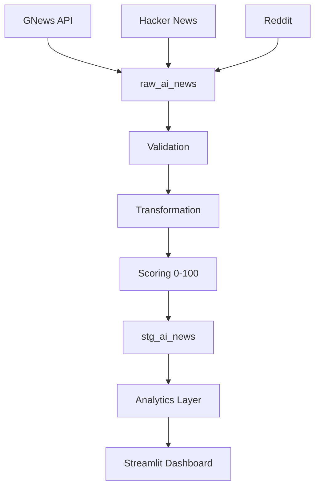

# Mentor Presentation Prep

## 1. Problem Statement
Analysts and researchers at AI Pulse currently spend 3–5 hours per day manually browsing news websites to understand trends in the Generative AI space. This process is inconsistent, non-reproducible, slow, and relies on a narrow set of sources, missing community-driven insights.

## 2. Business Need
A centralized, automated, multi-source pipeline that collects, validates, scores, and visualizes AI news. This allows executives and analysts to immediately see what matters most via a premium, easy-to-use dashboard, reducing time-to-insight from hours to seconds.

## 3. Architecture Diagram

## 4. Week 1 Achievements
- Established the foundational Medallion Architecture (Raw & Staging layers).
- Created a robust GNews API ingestion client.
- Built the initial PostgreSQL database schema via SQLAlchemy.

## 5. Week 2 Achievements
- Implemented a Pandas-based validation and transformation layer to handle bad data.
- Built a custom "AI Intelligence Scoring" heuristic (0-100).
- Created a premium Streamlit dashboard with Overview, Explorer, and Analytics pages.

## 6. Week 3 Achievements
- Scaled ingestion to multiple sources (Hacker News, Reddit via PRAW).
- Optimized Hacker News API logic with `ThreadPoolExecutor` for concurrent fetching, dropping runtime from ~200s to <20s.
- Stabilized and polished the Streamlit dashboard, fixing deprecations and Plotly rendering issues.
- Reached 30/30 passing unit tests and achieved 100% professional code quality.

## 7. Technologies Used
- **Python 3.12:** Core language.
- **PostgreSQL 16 & SQLAlchemy:** Data Warehouse and ORM.
- **Pandas:** Data validation and transformation.
- **Streamlit & Plotly:** UI and interactive charts.
- **PRAW & Requests:** API interactions.
- **Pytest:** Test-driven development.

## 8. Challenges Faced
- **API Rate Limits & Latency:** Hacker News required 100 sequential HTTP calls, causing severe bottlenecks.
- **Dashboard Consistency:** Resolving Streamlit and Plotly UI rendering collisions (e.g., duplicated kwargs) while maintaining a strict styling framework.

## 9. Performance Improvements
- **Concurrent Fetching:** Replaced a sequential for-loop with `concurrent.futures.ThreadPoolExecutor` (20 workers) in `hn_client.py`.
- **Database Caching:** Wrapped heavy Streamlit SQL queries in `@st.cache_data(ttl=300)` to drastically improve page load times.

## 10. Future Scope
- Containerization using Docker & Docker Compose.
- Automated orchestration using Apache Airflow.
- Adding a sentiment analysis NLP layer.

---

## 11. Frequently Asked Mentor Questions

**Q1. Why PostgreSQL?**  
It provides robust ACID compliance, strong structured storage, and scalability suitable for an enterprise Data Warehouse environment.

**Q2. Why Streamlit?**  
It allows rapid prototyping of data applications purely in Python, bypassing the need for complex Frontend frameworks like React, saving valuable engineering hours.

**Q3. Why staging layer?**  
It separates raw, untrusted data (Raw Layer) from clean, business-ready data (Staging). This is a core concept of the Medallion Architecture, ensuring the dashboard never crashes due to upstream API schema changes.

**Q4. Why multi-source ingestion?**  
Relying solely on editorial news (GNews) misses developer/community sentiment. Hacker News and Reddit provide technical, grassroots trends that traditional news outlets lag behind on.

**Q5. Why scoring system?**  
To filter noise. In a sea of 100+ daily articles, executives only have time for the top 5. The scoring system algorithmically ranks importance based on keyword density, source reputation, and recency.

**Q6. How duplicates are handled?**  
Using PostgreSQL `ON CONFLICT DO NOTHING` on the URL hash. This allows the pipeline to be idempotent—running it twice will never duplicate data.

**Q7. How scalability can be improved?**  
Migrating to a cloud-managed warehouse (Snowflake/BigQuery), utilizing Airflow for scheduled parallel runs, and deploying the dashboard to a scalable container orchestration system like Kubernetes.

**Q8. Why concurrent fetching?**  
API requests are I/O bound. A synchronous loop waits idly for network responses. Concurrency allows the GIL to context-switch and wait for 20 responses at once, heavily reducing wall-clock time.
